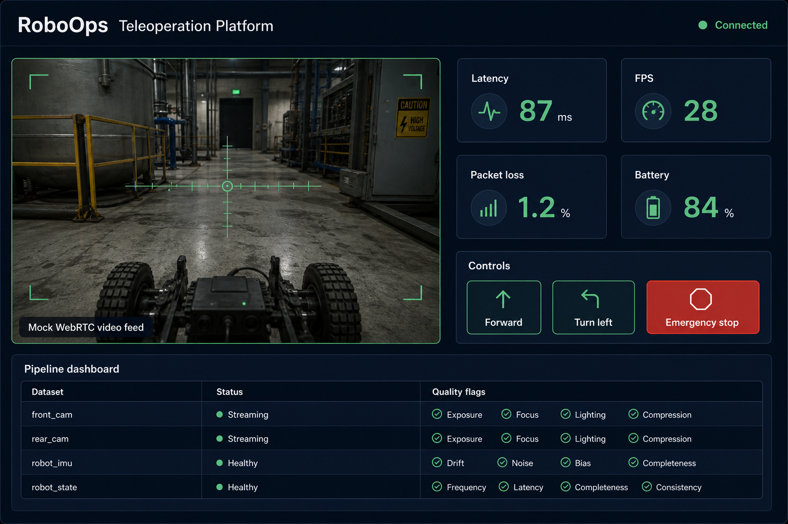
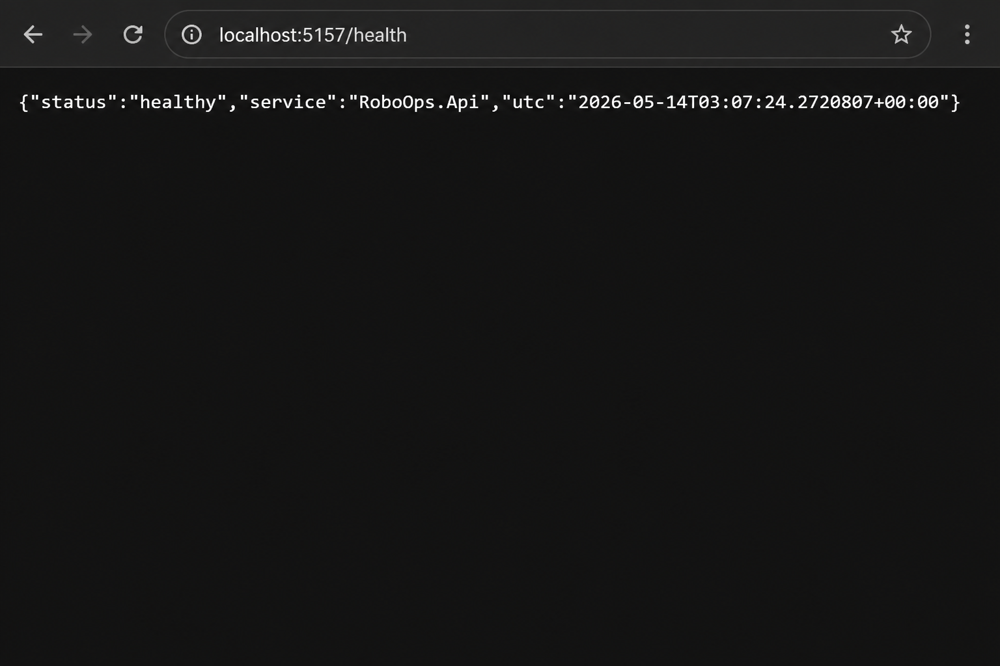

# RoboOps Teleoperation Platform

RoboOps is a portfolio-grade teleoperation and data-collection platform built to demonstrate the kind of engineering used by robotics, VLA and Data/ML platform teams.

The project simulates a robot fleet, streams real-time telemetry to an operator console, accepts low-latency control commands, collects data-quality feedback and exposes internal dashboards for pipeline monitoring and robot configuration management.

## Why this project exists

This repository targets roles that combine robotics operations, web-based internal tools, real-time systems and data platform workflows.

It showcases:

- Real-time robot telemetry and teleoperation commands with SignalR.
- Operator-facing UI for monitoring latency, FPS, packet loss and robot state.
- Data-quality feedback to improve downstream training datasets.
- Session and pipeline dashboards for data ingestion workflows.
- Configuration metadata for robots, sensors, camera profiles and tasks.
- Demo JWT authentication and role-based access control.
- Professional GitHub workflow with CI, PR templates, issues and documentation.

## Tech stack

- Backend: .NET 10, ASP.NET Core, SignalR, JWT auth.
- Frontend: Vue 3, TypeScript, Vite, SignalR client.
- Local platform: Docker Compose, PostgreSQL and Redis placeholders.
- CI: GitHub Actions for backend build/tests and frontend typecheck/build.

## Repository structure

```text
backend/
  RoboOps.Api/       ASP.NET Core API, auth, REST endpoints and SignalR hub
  RoboOps.Worker/    Mock ingestion worker for data pipeline simulation
frontend/
  operator-console/  Vue 3 operator console and dashboards
docs/
  adr/               Architecture decision records
  screenshots/       README preview images (replace with your own captures anytime)
.github/
  workflows/         CI pipeline
```

## Environment variables

| Name | Where | Purpose |
| --- | --- | --- |
| `VITE_API_BASE_URL` | Operator console (Vite) | Base URL for REST and SignalR (default `http://localhost:5157`). |
| `Auth__SigningKey` | API (`appsettings` or env) | Symmetric key for signing demo JWTs. Override in any non-local deployment. |

Local frontend setup:

```bash
cp frontend/operator-console/.env.example frontend/operator-console/.env.local
```

See also the repo root [`.env.example`](.env.example) for a single copy-paste reference used with Docker or shell exports.

## Run locally

Prerequisites:

- .NET 10 SDK
- Node.js 22+
- npm 11+

Start the API:

```bash
dotnet run --project backend/RoboOps.Api/RoboOps.Api.csproj
```

Start the operator console:

```bash
cd frontend/operator-console
npm install
npm run dev
```

Open `http://localhost:5173`.

## Screenshots

Representative previews of the local experience (run the apps above for the interactive UI and live data).



*Operator console: teleoperation view, telemetry, controls, and pipeline summary.*



*`GET /health` JSON response.*

### Troubleshooting

**GitHub CLI (`gh auth login`) fails after browser success**

Some networks block `api.github.com` while `github.com` still works. If `gh auth login` errors on `https://api.github.com/graphql`, skip `gh` for auth and use Git directly: create an empty repository in the browser, add `origin`, then `git push` over HTTPS.

**Device login opens the wrong browser**

Set the browser explicitly before `gh auth login`, for example:

```powershell
$env:GH_BROWSER = "C:\Program Files\Google\Chrome\Application\chrome.exe"
gh auth login
```

Demo credentials used by the UI:

- Username: `admin`
- Password: `roboops`
- Role: `Admin`

## API highlights

- `GET /health` - service health.
- `POST /api/auth/login` - demo JWT login.
- `GET /api/robots` - robot fleet and configuration metadata.
- `GET /api/tasks` - teleoperation task definitions.
- `POST /api/sessions` - start a teleoperation session.
- `POST /api/sessions/{id}/feedback` - submit data-quality feedback.
- `GET /api/pipelines` - monitor ingestion status.
- `/hubs/telemetry` - SignalR hub for live telemetry and commands.

## Workflow

The project is intended to be developed like a real product:

1. Create a small GitHub issue.
2. Create a short-lived branch, such as `feature/realtime-telemetry`.
3. Implement one scoped change.
4. Run build, tests and frontend build.
5. Commit with Conventional Commits.
6. Open a pull request with summary, test plan and screenshots when UI changes.

## Quality bar

The repository should stay interview-ready:

- Keep README and docs in English.
- Keep commits focused and descriptive.
- Add tests for business logic and risky integration points.
- Keep CI green.
- Document relevant tradeoffs in `docs/adr`.

## Integration tests

Run:

```bash
dotnet test RoboOps.slnx
```

The suite includes HTTP integration coverage for authentication, protected resources, and the **teleoperation data path**: starting a session, submitting data-quality feedback, reading the computed quality breakdown, and verifying that the `Operator` role cannot submit reviewer feedback.

## Current status

The MVP includes an in-memory API, simulated telemetry, demo auth/RBAC, a Vue operator console, quality feedback, mock pipeline status and CI configuration.
