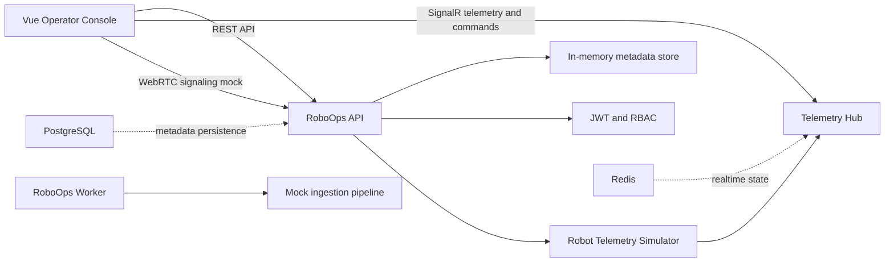

# Architecture

RoboOps is organized as a monorepo with a .NET backend, a Vue operator console and a worker process for mock data ingestion.

## Runtime flow

1. The operator console signs in through `POST /api/auth/login` using demo credentials.
2. The frontend loads robots, tasks, sessions and initial telemetry snapshots over REST.
3. The frontend connects to `/hubs/telemetry` with the JWT token.
4. The API telemetry simulator publishes robot state every second.
5. Operators send commands through SignalR.
6. Reviewers submit data-quality feedback against a session.
7. Pipeline status reflects captured sessions and quality flags.

## Domain model

- `Robot` stores fleet metadata and configuration revisions.
- `TaskDefinition` describes collection tasks and required labels.
- `TeleoperationSession` represents an operator-controlled data collection run.
- `DataQualityFeedback` captures reviewer/operator quality signals.
- `PipelineRun` exposes ingestion status for downstream data workflows.

## Security model

The MVP uses demo JWT auth to keep local setup simple while still demonstrating secure communication boundaries:

- `Admin` can operate robots and review data.
- `Operator` can start sessions and send commands.
- `Reviewer` can submit data-quality feedback.
- `DataEngineer` can inspect pipeline state.

Production hardening would replace the demo login with an external identity provider, persist users and rotate signing keys through a secret manager.
